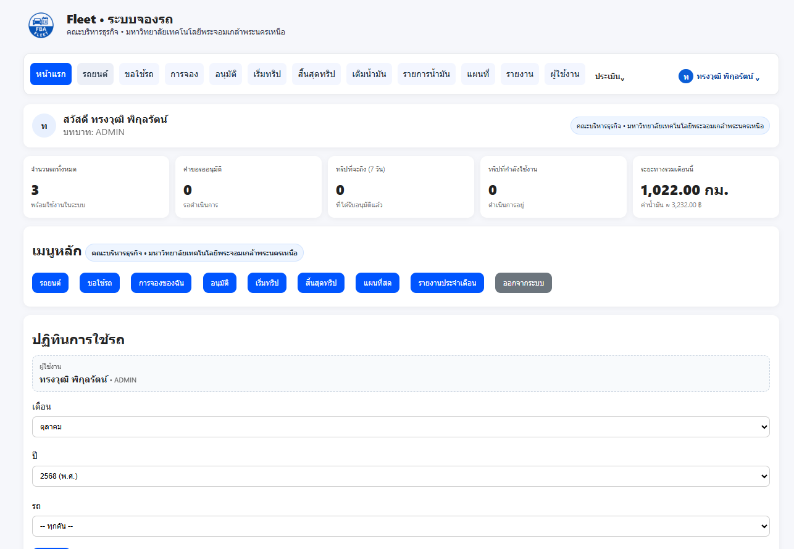
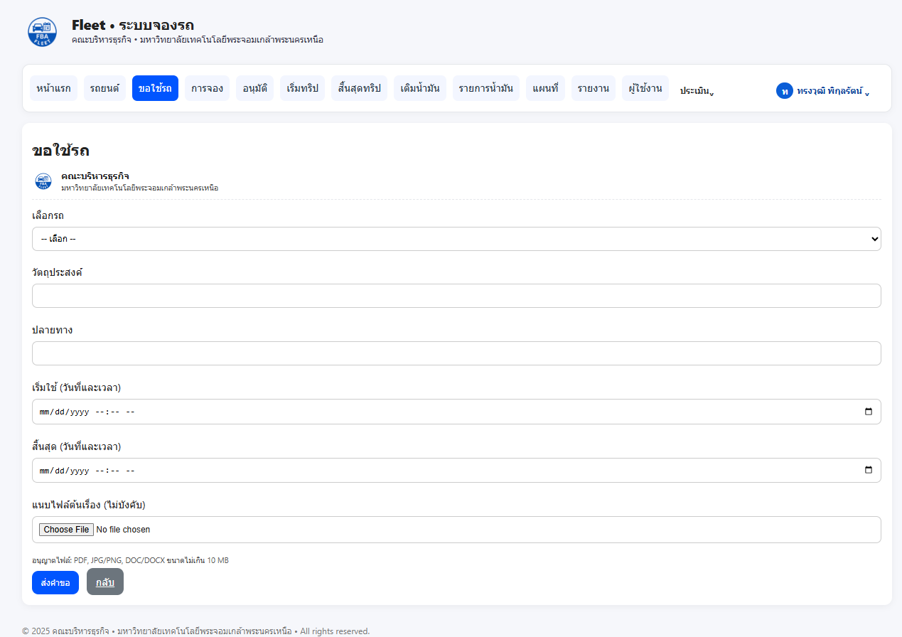
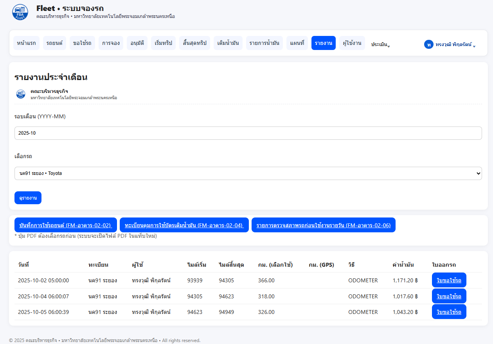

# 🚗 Fleet — ระบบจองรถ (Vehicle Booking System)

ระบบบริหารการจองรถราชการสำหรับหน่วยงาน  
พัฒนาโดยคณะบริหารธุรกิจ มหาวิทยาลัยเทคโนโลยีพระจอมเกล้าพระนครเหนือ วิทยาเขตระยอง  

ระบบนี้ช่วยให้การ **จองรถ, อนุมัติ, ติดตามสถานะ และบันทึกการใช้งาน** ทำได้ง่ายในที่เดียว  
พร้อมเชื่อมต่อกับ **LINE OA**, ระบบ **ICIT SSO**, และแสดงสถิติการใช้งานรถแบบเรียลไทม์  

---

## 🌐 DEMO / Preview
> 🔗 
> *(ระบบใช้งานจริงของคณะบริหารธุรกิจ มจพ. ระยอง)*

---

## 🧩 ฟีเจอร์หลัก

### 🚘 การจองรถ
- ผู้ใช้ทั่วไปสามารถส่งคำขอใช้รถผ่านระบบออนไลน์  
- มีระบบตรวจสอบเวลาทับซ้อนของรถโดยอัตโนมัติ  
- แสดงสถานะการจอง: **รอตรวจสอบ → อนุมัติแล้ว → เดินทาง → เสร็จสิ้น**

### ✅ ระบบอนุมัติหลายระดับ
- รองรับผู้อนุมัติหลายระดับ (เช่น หัวหน้างาน, ผู้บริหาร)  
- ผู้อนุมัติสามารถตรวจสอบและอนุมัติได้ผ่านหน้าเว็บหรือ LINE OA  

### 🧭 การติดตามการเดินทาง
- บันทึกเลขไมล์ก่อน–หลังการใช้งาน  
- สรุประยะทางรวมและค่าเชื้อเพลิงอัตโนมัติ  
- แสดงรายงานในรูปแบบกราฟและตารางสรุป  

### 👨‍✈️ จัดการพนักงานขับรถ
- เพิ่ม / ลบ / แก้ไขข้อมูลคนขับรถ  
- ระบบแสดงสถานะว่ากำลังอยู่ระหว่างภารกิจหรือว่าง  
- ผู้ดูแลสามารถมอบหมายรถให้คนขับได้โดยตรง  

### 🧾 รายงานและ Dashboard
- สรุปรายงานการใช้งานรายเดือน / รายปี  
- Export รายงานเป็น PDF หรือ Excel  
- Dashboard แสดงข้อมูลสรุปและสถิติการใช้งานรถแบบเรียลไทม์  

---

## 🖼️ ตัวอย่างหน้าจอระบบ

| Dashboard | ฟอร์มขอใช้รถ | รายงานประจำเดือน |
|------------|----------------|--------------------|
|  |  |  |

> ตัวอย่างจากระบบจริงของ “Fleet – ระบบจองรถราชการ”  
> คณะบริหารธุรกิจ มจพ. วิทยาเขตระยอง

---

## ⚙️ เทคโนโลยีที่ใช้

| ส่วนระบบ | เทคโนโลยี |
|------------|------------|
| Backend | PHP 8.x (PDO / MVC), MySQL |
| Frontend | HTML5, Bootstrap 5, JavaScript (Fetch API) |
| Authentication | ICIT SSO / LINE Login |
| Notification | LINE Messaging API |
| PDF Export | mPDF |
| Hosting | XAMPP / InfinityFree / VPS |

---

## 🧭 โครงสร้างโปรเจกต์

fleet/ <br>
├── assets/ # ไฟล์ CSS, JS, รูปภาพ <br>
├── docs/ # Screenshots, README images <br>
├── inc/ # Config, DB, Helper functions <br>
├── migrations/ # สคริปต์จัดการ schema (optional) <br>
├── nbproject/ # โปรเจกต์ของ NetBeans<br>
├── public/ # หน้าเว็บหลักของผู้ใช้<br>
├── sql/ # โครงสร้างฐานข้อมูล (schema)<br>
├── composer.json<br>
├── index.php<br>
└── README.md<br>


---

## 🚀 วิธีติดตั้ง<br>

1. **Clone โปรเจกต์**<br>
   ```bash<br>
   git clone https://github.com/songwuten484-max/fleet.git<br>
   cd fleet<br>
   
2. ตั้งค่า Database<br>
สร้างฐานข้อมูลใหม่ใน phpMyAdmin<br>
Import ไฟล์ sql/fleet.sql<br>
แก้ไขค่าการเชื่อมต่อใน inc/config.php<br>

3. ติดตั้ง dependencies<br>
   composer install<br>
4. เปิดระบบผ่านเบราว์เซอร์ http://localhost/fleet/public/<br>

👨‍💻 ผู้พัฒนา<br>
Oat — วิศวกรไฟฟ้า / โปรแกรมเมอร์ คณะบริหารธุรกิจ มจพ. ระยอง<br>
💼 Full-stack Developer (PHP, MySQL, Bootstrap)<br>
⚙️ Electrical Engineer & System Integrator<br>
💡 สนใจงานด้าน Business Systems, SaaS, Automation<br>
🌐 GitHub: songwuten484-max<br>

📄 License<br>

Distributed under the MIT License.<br>
See LICENSE for more information.<br>

หมายเหตุเพิ่มเติม<br>
ระบบนี้สามารถต่อยอดเป็นระบบ Fleet สำหรับหน่วยงาน, โรงเรียน, หรือองค์กรภาครัฐ<br>
รองรับการต่อเชื่อมกับระบบแจ้งซ่อมหรือระบบห้องประชุมในอนาคต<br>

⭐ ถ้าชอบระบบนี้<br>
กด ⭐ ที่ repo เพื่อเป็นกำลังใจให้ผู้พัฒนา ❤️<br>
